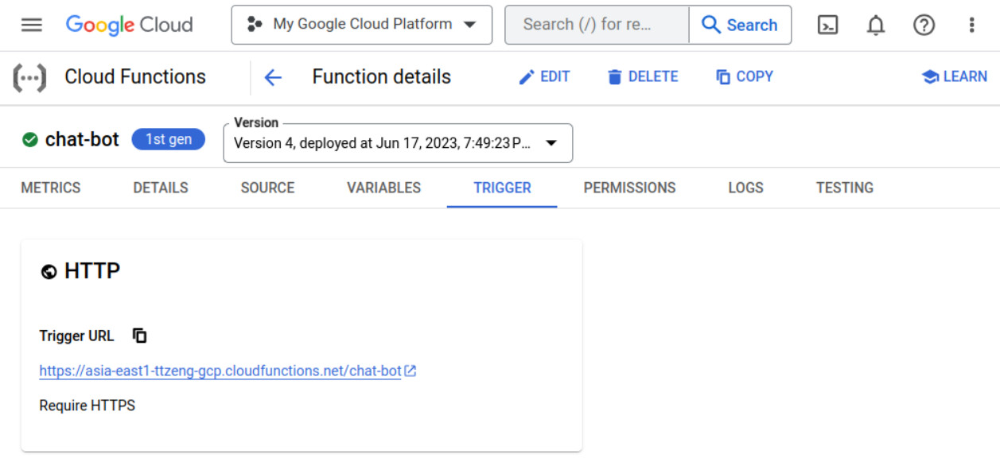
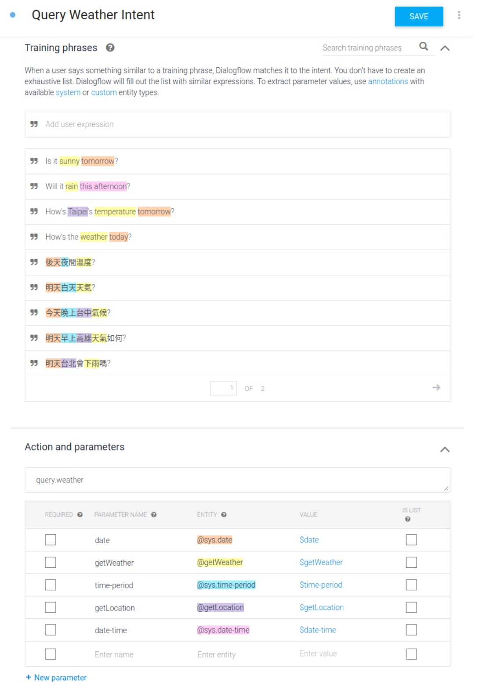
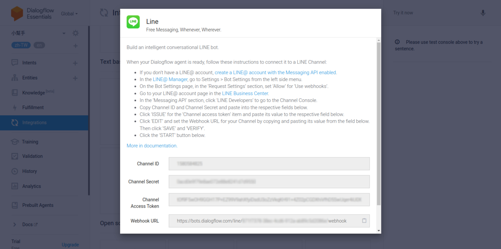
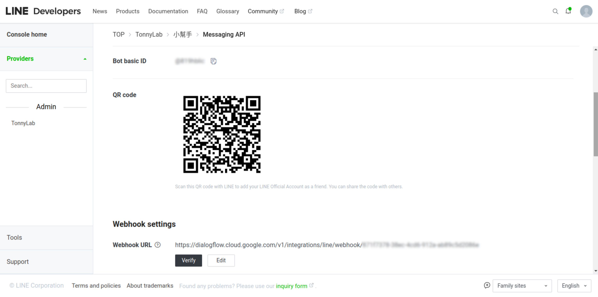

# My LINE chat bot

## Overview
This repository contains the source code of my LINE chat bot, leveraging Dialogflow, LINE Messaging API, Open Data API from [Central Weather Administration (中央氣象署)](https://opendata.cwa.gov.tw/index), and OpenAI API technologies.

The chat bot uses [Dialogflow](https://cloud.google.com/dialogflow) to handle user chat messages. Dialogflow is a **natural language understanding platform** that provides a conversational user interface for integrating to mobile apps, devices, bots, and web services, etc. Diaglogflow translates end-user text or audio during a conversation to structured data that computer programs can understand through virtual [agents](https://cloud.google.com/dialogflow/es/docs/agents-overview), where agents match the end-user expression to the best combined [intents](https://cloud.google.com/dialogflow/es/docs/intents-overview) (i.e. *intent classification*) to handle a complete conversation. Dialogflow also [integrates](https://cloud.google.com/dialogflow/es/docs/integrations) with many conversation platforms such as Google Chat, Facebook Messenger, and [LINE](https://cloud.google.com/dialogflow/es/docs/integrations/line) to handle end-user interactions in a platform-specific way. In addition to static responses, [fulfillments](https://cloud.google.com/dialogflow/es/docs/fulfillment-overview) can be enabled to call an user predefined service (i.e. *webhook*) to provide a more dynamic response.

## How to Set up
1. Before deploying this LINE chat bot, follow [this guide](https://developers.line.biz/en/docs/messaging-api/getting-started/) to create a channel using [LINE Developers Console](https://developers.line.biz/console/) - the portal to manage [Developer](https://developers.line.biz/en/docs/line-developers-console/overview/#developer), [Provider](https://developers.line.biz/en/docs/line-developers-console/overview/#provider), and [Channel](https://developers.line.biz/en/docs/line-developers-console/overview/#channel) on the LINE Platform.

2. Deploy the source code of this repository as a web service. Since the chat bot requires the [access token](https://developers.line.biz/en/docs/messaging-api/channel-access-tokens/) (<u>**LINE_CHANNEL_ACCESS_TOKEN**</u>) and channel secret (<u>**LINE_CHANNEL_SECRET**</u>) created in the previous step, the [authorization key](https://opendata.cwa.gov.tw/devManual/insrtuction) (<u>**CWB_AUTHORIZATION_KEY**</u>) for accessing the Open Weather Data platform by CWA (中央氣象署), as well as the [OpenAI secret API key](https://platform.openai.com/docs/api-reference/authentication) (<u>**OPENAI_API_KEY**</u>) when invoking individual APIs, these secrets must be either provided in a local file named \"`.env`\", or manually configured as environment runtime variables for the web service. For example, the chat bot service is hosted on Google [Cloud Functions](https://cloud.google.com/functions) as below.

   

3. Follow [this guide](https://cloud.google.com/dialogflow/es/docs/quick/build-agent) to create an agent using [Dialogflow ES Console](https://dialogflow.cloud.google.com/). The new agent initially has two [default intents](https://cloud.google.com/dialogflow/es/docs/intents-default): *Default Fallback Intent* and *Default Welcome Intent*. The default welcome intent is supposed to be matched while starting a conversation with greetings, but it is removed afterward for this chat bot, since we are going to proxy the fallback query messages to [OpenAI](https://platform.openai.com/docs/introduction) for Generative Pre-trained Transformers (a.k.a., GPT) responses. 

4. Click **Entities** in the left sidebar menu, and add "`@getLocation`" and "`@getWeather`" [custom entities](https://cloud.google.com/dialogflow/es/docs/entities-custom) to match location (e.g. "台北") and weather (e.g. "天氣", "晴天") specific keywords. These entities will be used during the training annotation in the next step, to extract the end-user expression to intent parameters.

5. Back to the **Intents** panel, create a "`Query Weather Intent`" and train the intent with phrases that users typically use to query whether data. [Annotate](https://cloud.google.com/dialogflow/es/docs/intents-training-phrases#annotation) the given phrases with system and/or custom entities created in the previous step, to train the agent for extracting parameter values.

   

6. Click **Fulfillment** in the left sidebar menu, enable `Webhook` feature and enter the trigger URL of the web service created in Step 2 to the `URL` field in the panel, then turn on \"`Enable webhook call for this intent`\" in the *Fulfillment* section of both \"Query Weather Intent\" and \"Default Fallback Intent\", the web service will be called by Dialogflow while matching the named intents.

7. Click **Integrations** in the left sidebar menu, select the LINE integration box, mark down the `Webhook URL` on the LINE integration pop-up window, and enter the URL to the `Webhook settings` of the LINE channel created in Step 1 to complete the setup.

   

   

## Resources
- [LINE Developers Console](https://developers.line.biz/console/)
- [Dialogflow ES Console](https://dialogflow.cloud.google.com/)
- [Google Cloud Functions Dashboard](https://console.cloud.google.com/functions/)
